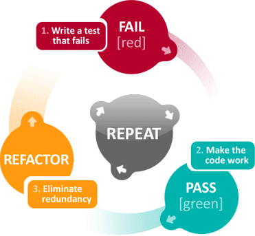

!SLIDE
# Teoria #

!SLIDE
# Test-Driven Development #
## Rozwijanie oprogramowania w oparciu o testy **automatyczne** ##

!SLIDE bullets incremental
# Poziomy testowania #
## Testy ##
* Jednostkowe
* Integracyjne
* Akceptacyjne

!SLIDE bullets incremental
# Testy jednostkowe #
* testują **jeden** z przypadków testowych **jednej** metody
* testują w **izolacji**
* testują poprawność **implementacji**

!SLIDE bullets incremental
# Testy integracyjne
* testują **całościową implementacje** sysemu
* testują połączenie naszego kodu z kodem z zewnętrz (vendor)
* testują integralność interfejsów
* testują poprawność projektu

!SLIDE bullets incremental
# Testy akceptacyjne
* testują przeciw wymaganiom klienta
* testują przeciwko wymaganiom **biznesowym**
* **nie** testują **implementacji**

!SLIDE center
