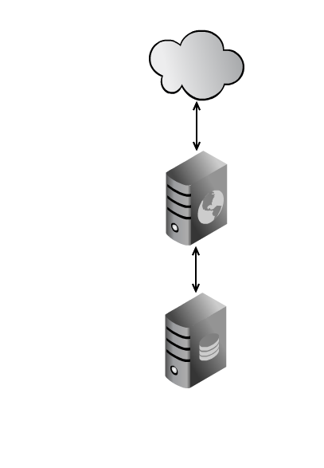
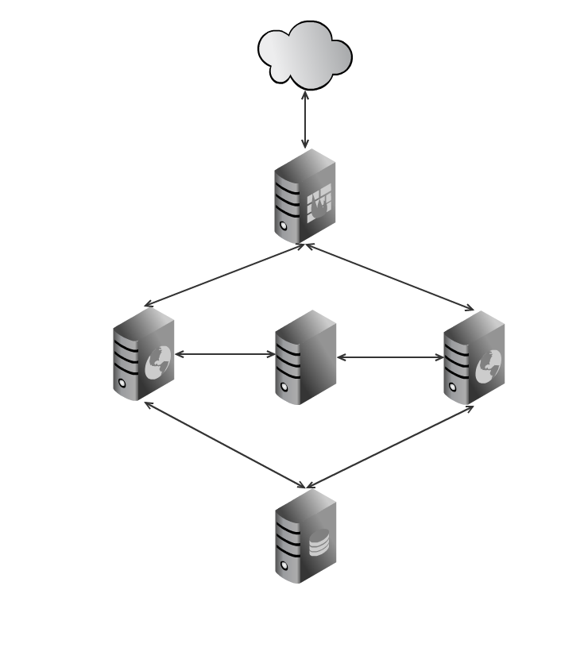

!SLIDE small transition=fade
# Konfiguracja #

    @@@Ruby
    set :application, "trug"
    set :repository, "https://github.com/trug/trug"
    set :deploy_to, "/home/trug/apps/trug"
    set :user, "trug"
    set :use_sudo, false

!SLIDE smaller transition=fade

## Zależności ##
    
    @@@Ruby
    depend :remote, :directory,
           "/data/rec",
           :roles => :node
    
    depend :remote, :file, 
           "/home/#{user}/bin/my_tricky_soft", 
           :roles => :node
    
    depend :remote, :writable,
           "/data/rec",
           :roles => :node
           
    depend :remote, :gem
           "delayed_job",
           :roles => :node           

!SLIDE center transition=fade

# Single stage, single server #

!SLIDE center transition=fade

!SLIDE transition=fade
    
    @@@Ruby
    role :app, "web-a-0.v.l"
    role :web, "web-a-0.v.l"
    role :db, "web-a-0.v.l"

!SLIDE transition=fade
# Single stage, multiple servers #

!SLIDE center transition=fade

!SLIDE transition=fade

    @@@Ruby
    role :app, "web-a-0.v.l", "web-a-1.v.l"
    role :web, "web-a-0.v.l", "web-a-1.v.l"
    role :db, "web-a-0.v.l"
     
!SLIDE transition=fade
# Multiple stages #

    $ gem install capistrano-ext
    $ config/deploy/beta.rb
    $ config/deploy/production.rb
    $ cap beta deploy
