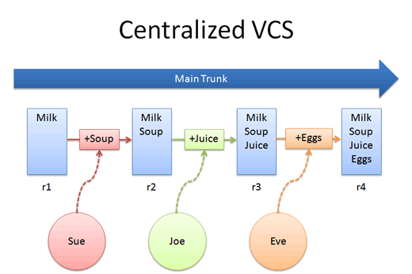
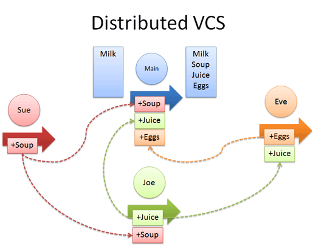

!SLIDE 
# Idea #

## DVCS - Distributed Version Control System ##

!SLIDE

# Przykłady #

    * git
    * Mercurial - hg
    * Bazaar
    * Darcs

!SLIDE center

!SLIDE center

!SLIDE

    * Każdy z użytkowników ma repozytorium
      u siebie lokalnie
    * Użytkownicy mogą wymieniać się zmianami
      - wiele mergy
    * Repozytorium centralne -
      łączy zmiany użytkowników