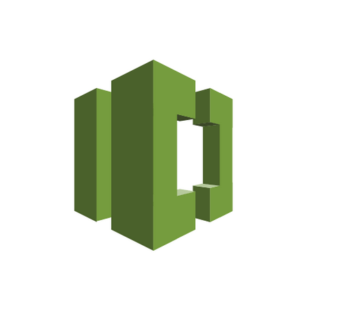
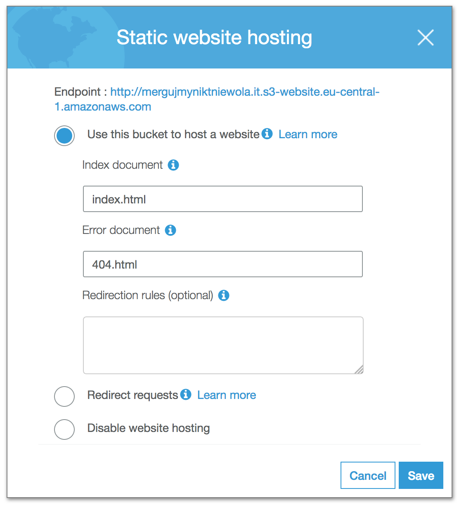

<!SLIDE center>
# AWS deploy pipeline for Jekyll blog
## Sebastian Nowak

<!SLIDE center zoom>
~~~SECTION:notes~~~
Za dużo Rubiego w tym nie ma. Standardowy Jekyll, bez żadnych dodatków.
~~~ENDSECTION~~~
# Jekyll
## jekyllrb.org

    @@@ Ruby
    gem install jekyll
    jekyll new mergujmyniktniewola

<!SLIDE center scrollLeft>

.callout.warning Spoiler alert

<!SLIDE center scrollLeft>
.callout.stop No more Ruby on this keynote

<!SLIDE center scrollLeft>
~~~SECTION:notes~~~
Ja kupiłem domenę w aftermarket.pl.
Pamiętajcie by później przestawić domenę na odpowienie DNS od Amazonu
~~~ENDSECTION~~~
## Buy domain

<!SLIDE center scrollLeft>
## Create git repository for your site

<!SLIDE center scrollLeft>
~~~SECTION:notes~~~
Ale nie Github, to byłoby zbyt proste.
Trochę zapachnie  teraz hipsterką, ale wybrałem ...
~~~ENDSECTION~~~
## Create git repository for your site
### Idea is to keep compiled html files in repository.

<!SLIDE center scrollLeftr>
~~~SECTION:notes~~~
Ktoś z Was używał? Słyszał? Ja też nigdy :)
Wygląda jak GitHub w 2008 roku.
Ja miałem trochę problemów z autentykacją do repozytorium.
AWS account root user nie ma dostępu do repozytorium.
Trzeba stworzyć standardowego użytkownika i dodać do niego klucz SSH.
Inna droga to `aws codecommit credential-helper` `jako credential.helper`
Polecam klucz SSH.
~~~ENDSECTION~~~
## Amazon Code Commit

<!SLIDE center>
## Place to keep static HTML files

<!SLIDE center>
~~~SECTION:notes~~~
Standardowy bucket S3 na początek.
~~~ENDSECTION~~~
## Amazon Simple Storage Service

<!SLIDE center>
# Amazon Simple Storage Service gotcha
## name bucket the same as domain

<!SLIDE subsection>
~~~SECTION:notes~~~
Ja gdzieś kiedyś słyszałem, że można coś takiego robić.
Nigdy dotąd nie próbowałem.
~~~ENDSECTION~~~
# Amazon Simple Storage Service
## Enable static website hosting

<!SLIDE center>
~~~SECTION:notes~~~
Jako metadane obiektów w bucketcie trzeba ustawić `Content-Type`.
Można ustawić również inne metadane. Ja ustawiam jeszcze `Cache-Control`.
~~~ENDSECTION~~~
## Setup correct headers for static files

    @@@JavaScript
    switch (extension) {
    case "html":
      return "text/html";
    case "css":
      return "text/css";
    case "js":
      return "text/javascript";
    default:
      return "text/html";
    }

<!SLIDE center>
~~~SECTION:notes~~~
Jako metadane obiektów w bucketcie trzeba ustawić `Content-Type`.
Można ustawić również inne metadane. Ja ustawiam jeszcze `Cache-Control`.
~~~ENDSECTION~~~
## Setup correct headers for static files

    @@@JavaScript
    switch (extension) {
    case "html":
      return "text/html";
    case "css":
      return "text/css";
    case "js":
      return "text/javascript";
    default:
      return "text/html";
    }

## Save them as object's metadata

<!SLIDE center>
~~~SECTION:notes~~~
Standardowy format domeny dla takie stronki hostowanej na S3 to
`nazwa-bucketa.s3-website.symbol-regionu.amazonaws.com`
~~~ENDSECTION~~~
## Now html files should be accessible under
### mergujmyniktniewola.it.s3-website.eu-central-1.amazonaws.com

<!SLIDE center>
## Content Delivery Network

<!SLIDE center bullets incremental>
~~~SECTION:notes~~~
CloudFront to CDN od Amazonu, jest raczej z tych prostszych CDNów, ale sprostał
moim wymaganiom.

W CF tworzy się 'dystrybucję'.

Można wybrać jedną z trzech klas cenowych. Ja wybrałem taką pośrednią, bez replikacji w Azji.
Włączyłem IPv6, wsparcie dla HTTP2.

Origin to źródło dla zasobów w CDN - powinno wskazywać na domenę z S3.

Behaviour - to lista zasad. Można mieć wiele takich ruli.

Można ustawić dodawanie właśnych 'cache headers' lub forwardować oryginalne.
Standardowo kompresja włączona

Invalidations - to ważne. Bez zinwalidowania dystrybucji w przeglądarce będą
stare pliki. `0,005$` za inwalidowaną ścieżkę, pierwsze 1000 za darmo.

Każda zmiana w dystrybucji musi być zdeployowana - trwa to od 10 do 20 minut.
~~~ENDSECTION~~~
## CloudFront

* Distribution's origin need to point to your "S3 Domain"
* Alternative CNAME should point to your "Real domain"
* Configure distribution's behaviour what you like
<!SLIDE center>
# Configure domain

<!SLIDE center>
## Amazon Route53

<!SLIDE center>
~~~SECTION:notes~~~
Najdroższe --- 0,50$ za hosted zone.
~~~ENDSECTION~~~
# Amazon Route53

## Most expensive part of this setup

<!SLIDE center bullets incremental>
~~~SECTION:notes~~~
Hosted Zone ---- więcej niż domena i subdomeny. Można zarządzać routingiem na
nieco bardziej skomplikowanych zasadach (Geolocation, Latency, ...)

Point alias - rekord A w Route53
~~~ENDSECTION~~~
# Domain < Hosted zone

* Container for domain record sets
* Point Alias to your CF "Distribution domain"

<!SLIDE center>
~~~SECTION:notes~~~
Cerytifkat za darmo.

Generujesz go za pomocą dockerowego kontenera.

Wrzucasz na na S3 w odpowiednie miejsce

Klikasz 'Verify' w panelu letsencrypt i już.

Trzeba pamiętać by po 90 dniach odnowić certyfikat
~~~ENDSECTION~~~
# HTTPS

## letsencrypt.org

<!SLIDE center bullets incremental>
~~~SECTION:notes~~~
By wszystko sklejć w całość użyłem funkcji na Lambdzie.
~~~ENDSECTION~~~
# Build script

* AWS Lambda function
* triggered by CodeCommit event
* uploads files to S3 bucket
* invalidates CloudFront distribution

<!SLIDE center bullets incremental>
~~~SECTION:notes~~~
Trochę pseudokodu.

Jako początkowy `event` jaki otrzymujemy na wejście funkcji zawiera podstawowe
informacje takie jaki SHA commita, author, data, branch, trochę amazonowej otoczki.

Oczywiście do wszystkich serwisów AWS dostajemy dobrze opisane SDK.
~~~ENDSECTION~~~
# Deploy function

    @@@
    for each difference in commitDiff
      getBlob and uploadToS3
    invalidateCDN

<!SLIDE center>
~~~SECTION:notes~~~
Nie intersują nas zmiany w całym repozytorium, ale tylko w katalogu ze zbudowaną
stroną i tylko z ostatniego commita.
after vs. before
~~~ENDSECTION~~~
# GetDifferences gotcha

    @@@JavaScript
    {
      repositoryName: repository,
      afterCommitSpecifier: 'HEAD',
      afterPath: '_site'
    }

<!SLIDE center>
~~~SECTION:notes~~~
Wspomniałem już o odświeżeniu dystrybucji CDN.
`CallerReference` --- wraz z `Paths` mogą być cachowane

Bez zinwalidowania dystrybucji w przeglądarce będą stare pliki. 0,005$ za
inwalidowaną ścieżkę, pierwsze 1000 za darmo.
~~~ENDSECTION~~~
# Invaldation gotcha

    @@@JavaScript
    {
      DistributionId: 'your-id',
      InvalidationBatch: {
        CallerReference: Date.now().toString(),
        Paths: {
          Quantity: 1,
          Items: ['/*']
        }
      }
    }

<!SLIDE center bullets incremental>
~~~SECTION:notes~~~
Serverless --- Function As A Service

Serverless --- nazwa frameworka (sls)

Nazwa turbosłaba, czasem znalezienie pomocy do tego frameworka to bitwa z
wiatrakami.
Ideowo `sls` ma służyć do deployowania na różne platformy
Amazon Lambda

Azure Functions

Google Functions

IBM OpenWhisk
~~~ENDSECTION~~~
# serverless.com

* platform independent
* super easy deploy
* easy function setup
* "easier" development

<!SLIDE center>
~~~SECTION:notes~~~
`sls` to deploy nie tylko funkcji ale też "infrastruktury".
Dlatego trzeba opisać do których zasobów funkcja ma mieć dostęp. CodeCommit, S3, CloudFront
~~~ENDSECTION~~~
# Lambda gotcha

    @@@
    iamRoleStatements:
    - Effect: "Allow"
      Action: "lambda:InvokeFunction"
      Resource: "arn:aws:lambda:eu-central-1:074085690284:function:*"
    - Effect: "Allow"
      Action:
        - "codecommit:GetBlob"
        - "codecommit:GetDifferences"
      Resource: "arn:aws:codecommit:eu-central-1:074085690284:target_bucket"
    - Effect: "Allow"
      Action:
        - "s3:PutObject"
      Resource: "*"
    - Effect: "Allow"
      Action: "cloudfront:CreateInvalidation"
      Resource: "*"

<!SLIDE center inverse code>
~~~SECTION:notes~~~
Event jest wyemitowany do funkcji niemal odrazu.

Poniżej log output dla jednego requestu. Output nie jest konfigurowalny.

1024MB jest domyślny. Minimalny to 128MB, maksymalny to 1536MB.

Z większą pamięcią idzie "większy CPU".

128 	3,200,000 	0.000000208

1024 	400,000 	0.000001667

1536 	266,667 	0.000002501
~~~ENDSECTION~~~

START RequestId: b22eff76-b4ee-11e7-8e2e-bb1cd594af69 Version: $LATEST
END RequestId: b22eff76-b4ee-11e7-8e2e-bb1cd594af69
REPORT RequestId: b22eff76-b4ee-11e7-8e2e-bb1cd594af69	Duration: 673.85 ms	Billed Duration: 700 ms 	Memory Size: 1024 MB	Max Memory Used: 43 MB

<!SLIDE center>
~~~SECTION:notes~~~
W przybliżeniu jedna tysięczna centa.
Po 86 000 uruchomień tej funkcji zapłacę 1USD.
~~~ENDSECTION~~~
## 7 * 0.000001667 = 0.000011669

## USD

<!SLIDE center bigtext>
## First 400k seconds
## for free

<!SLIDE center>

.callout.question Please ask
