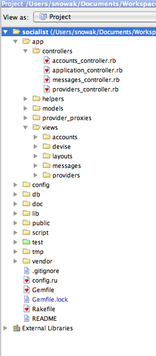

!SLIDE
# Katalogi w projekcie Rails #

!SLIDE center

!SLIDE bullets incremental
## Nazwy ##
  * index.html.rhtml
  * index.rss.builder
  * _form.html.rhtml

!SLIDE smaller
## Layout ##
    @@@Html
    <html>
      <head>
        <title>Super site!</title>
        <%= stylesheet_link_tag :all %>
        <%= javascript_include_tag :defaults %>
        <%= csrf_meta_tag %>
      </head>
      <body>
        

          <%= yield %>
        

      </body>
    </html>

!SLIDE smaller
## Partiale ##
    @@@Html
    New & edit user
    <%= render "form" %>
    <%= render :partial => "form" %>
    app/views/users/new.html.rhtml
    app/views/users/_form.html.rhtml

    <% form_for @user do %>
    <% end %>

!SLIDE smaller
## Paritale - locals ##
    @@@Html
    <%= render "form", :locals => { :user => @user, 
      :action_type => "Edit" } %>
    
    <% form_for user do %>
      
Please #{ action_type } user

    <% end %>

!SLIDE smaller
## Partiale - object ##
    @@@Html
    <%= render :partial => "user", :object => @user %>
    <%= render @user %>
      
    # partial _user.html.rhtml
    

      User login: <%= user.login %>
    

!SLIDE smaller
## Partiale - collection ##
    @@@Html
    <%= render :parital => "user", :collection => @users %>
    <%= render @users %>
    
    # partial _user.html.rhtml
    

      User login: <%= user.login %>
    

